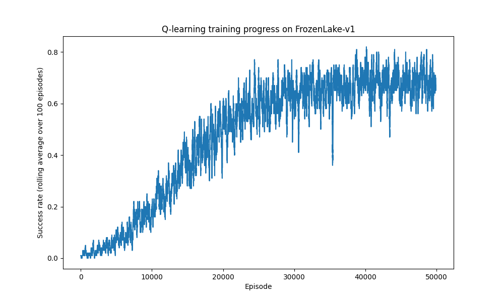
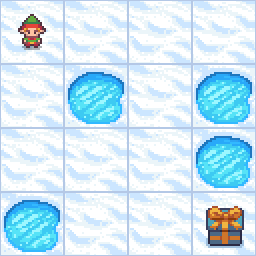
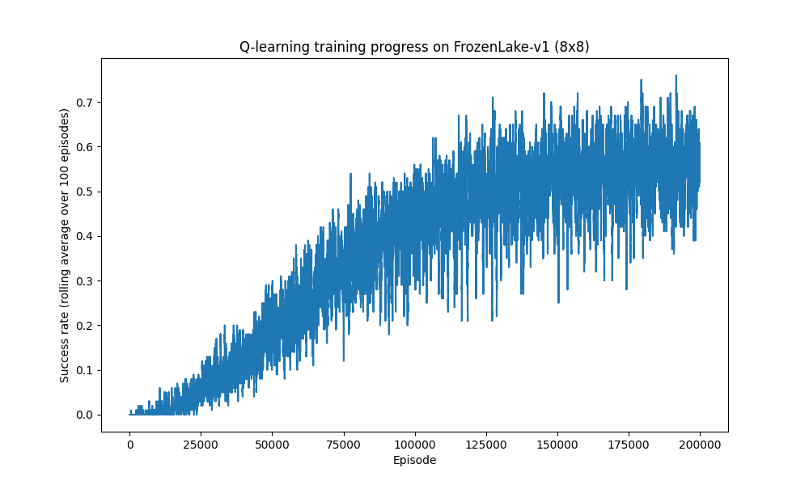
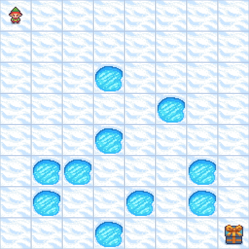
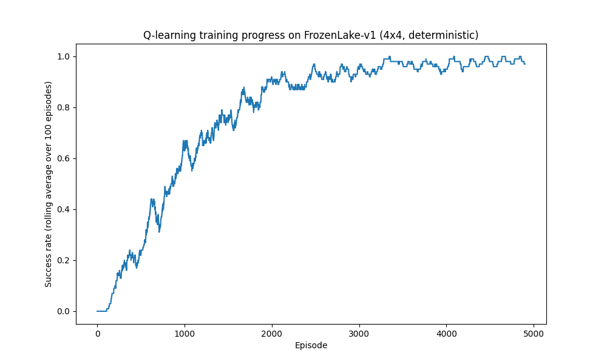
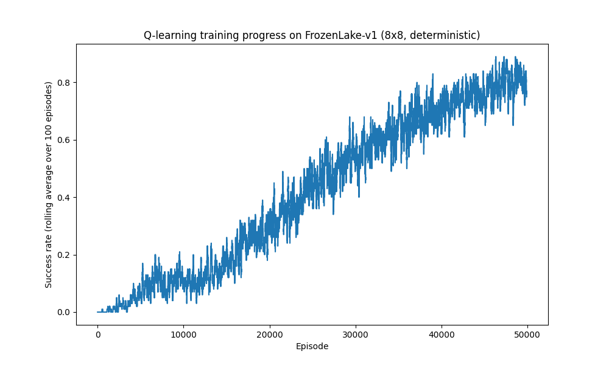

# FrozenLake Q-Learning Agent

A tabular Q-learning agent trained from scratch to solve the FrozenLake-v1 environment from Gymnasium.

## What is Reinforcement Learning?

Reinforcement learning (RL) is a way of training an agent to make decisions by letting it interact with an environment and learn from the outcomes of its actions. The agent observes a state, takes an action, and receives a reward. Over many attempts, it learns which actions lead to good outcomes and which don't, without ever being told the "correct" action directly. This is different from supervised learning, where a model is given labeled examples of correct answers.

## What is Q-Learning?

Q-learning is one of the simplest RL algorithms. It keeps a table (the Q-table) with one row per state and one column per action. Each entry, Q(state, action), estimates how good it is to take that action from that state, in terms of expected future reward.

The agent updates this table using the rule:

```
Q(s, a) = Q(s, a) + learning_rate * (reward + discount_rate * max(Q(s', a')) - Q(s, a))
```

While training, the agent uses an epsilon-greedy strategy: with probability epsilon it takes a random action (exploration), and otherwise it takes the action with the highest Q-value (exploitation). Epsilon starts high so the agent explores a lot early on, then decays over time so the agent increasingly relies on what it has learned.

Once training is done, the Q-table itself is the agent's policy: in any state, just pick the action with the highest Q-value.

## What is FrozenLake?

FrozenLake is a classic grid-world environment from Gymnasium. The agent starts at one corner of a 4x4 grid of ice and has to reach a goal tile at the opposite corner without falling into any holes. Each tile is one of:

- `S` start tile
- `F` frozen tile, safe to walk on
- `H` hole, falling in ends the episode with no reward
- `G` goal, reaching it ends the episode with a reward of 1

The environment can run in `is_slippery=True` mode, where the ice is slippery and the agent's action only succeeds with some probability, sometimes sliding it sideways instead. This makes the environment genuinely stochastic, not just a fixed maze to memorize.

### Why `is_slippery=True`

This project trains on the slippery version of the map. It is the harder, more realistic setting: since actions do not always do what you expect, the agent has to learn a policy that is robust to randomness rather than a single fixed path. It also makes Q-learning's convergence properties much more visible in the training curve, since a non-slippery 4x4 map is small enough that an agent can trivially reach 100% success rate after very little training, which is not an interesting demonstration of the algorithm. With enough training episodes, tabular Q-learning still converges to a strong policy on the slippery map, just with a success rate below 100% since some falls into holes are due to chance and unavoidable even with the optimal policy.

## Project Files

- `train.py` trains the Q-learning agent and saves the Q-table
- `evaluate.py` loads the saved Q-table and reports success rate and average steps, compared against a random policy baseline
- `demo.py` renders the trained agent solving the environment and saves the result as a GIF
- `plot_training.py` plots the training curve from the saved reward history
- `q_learning.py` the actual Q-learning building blocks (action selection, the Q-table update rule, epsilon decay), shared by `train.py`
- `frozenlake_common.py` shared config: hyperparameters per map/slippery setting and the output filenames each run produces
- `sweep.py` the script I used to try out different hyperparameter combinations for 4x4 slippery, not needed to reproduce the final results

All four scripts above take `--map {4x4,8x8}` and `--slippery`/`--no-slippery` flags, so the same script handles all four configurations (4x4 slippery, 8x8 slippery, 4x4 deterministic, 8x8 deterministic) instead of having a separate near-duplicate file per configuration. Output filenames are derived automatically from the flags, matching the filenames referenced throughout this README (for example `q_table.npy` for 4x4 slippery, `q_table_8x8.npy` for 8x8 slippery, `q_table_4x4_deterministic.npy` and `q_table_8x8_deterministic.npy` for the non-slippery runs). Internally, `train.py` uses a plain Q-learning loop for three of the four configurations, and switches to the vectorized/optimistic-init/plateau-detection approach described in the 8x8 comparison section below specifically for 8x8 slippery, since that's the one configuration that needed it.

## Installation

Requires Python 3.10 or later.

```
python3 -m venv .venv
source .venv/bin/activate
pip install -r requirements.txt
```

## Running

Train the agent, picking a map and whether the ice is slippery:

```
python3 train.py --map 4x4 --slippery
```

This saves the Q-table and the reward history for that configuration (for example `q_table.npy` and `rewards_per_episode.npy` for `--map 4x4 --slippery`).

Evaluate the trained agent against a random baseline:

```
python3 evaluate.py --map 4x4 --slippery
```

Plot the training curve:

```
python3 plot_training.py --map 4x4 --slippery
```

Generate a GIF of the trained agent solving the environment:

```
python3 demo.py --map 4x4 --slippery
```

Swap in `--map 8x8` and/or `--no-slippery` to run any of the other three configurations, e.g. `python3 train.py --map 8x8 --no-slippery`. Every script in this project uses the same `--map`/`--slippery` flags.

## Hyperparameter Tuning

After getting a working baseline, I wrote a small `sweep.py` script to try out different combinations of episodes, learning rate, discount factor (gamma), and epsilon decay, evaluating each one over 1000 greedy episodes instead of 100 so the success rate numbers weren't just noise. Gamma mattered the most out of everything I tried: dropping it from 0.99 to 0.95 or 0.9 consistently hurt performance, since a lower gamma makes the agent care less about the reward at the goal, which is far away in terms of steps. The best combination I found was 50,000 episodes, learning rate 0.1, gamma 0.99, and a slightly slower epsilon decay rate of 0.0001 (compared to 0.00015 in my first version), and I updated `train.py` to use these settings. `sweep.py` is left in the repo as the script I used to do this, it's not part of the main pipeline.

## Results

Evaluated over 1000 episodes with a greedy policy (no exploration), compared to 1000 episodes of a random policy baseline. I bumped this up from 100 episodes in an earlier version since 100 episodes was giving noisy success rate estimates during tuning:

| Policy | Success Rate | Average Steps |
|---|---|---|
| Random (before training) | 1.4% | 7.5 |
| Trained Q-learning agent (after training) | 73.8% | 45.5 |

The random policy almost always falls into a hole quickly. The trained agent reaches the goal in the large majority of episodes, and takes longer paths on average because it favors safer routes around holes rather than the shortest path, which matters on slippery ice where a shorter but riskier path is more likely to end in a fall.

### Training Curve



The curve shows the rolling average success rate over training. The agent starts at close to 0% (all random exploration) and climbs steadily as epsilon decays, leveling off once the Q-table has converged.

### Demo



Three episodes of the trained agent navigating the ice grid to reach the goal.

## 8x8 Comparison

I also trained the same Q-learning approach on the 8x8 version of the map (`train_8x8.py`), just to see how it holds up when the problem gets bigger. 8x8 has 64 states instead of 16, so the Q-table is 4x larger, the shortest path to the goal is much longer, and there are more holes to fall into along the way. All of that makes the exploration problem a lot harder: a random policy on 4x4 still stumbles into the goal every so often, but on 8x8 a random policy almost never reaches it (I measured about 1 in 900 random episodes reaching the goal), so the agent needs a lot more training just to see the reward even once before it can start learning from it.

It's a known fact for slippery FrozenLake that plain Q-learning tops out well below 100%, because the slip mechanic means even the optimal policy sometimes slides into a hole no matter what action it picks. For 4x4 that ceiling is commonly cited as around 70-75%, which lines up with the 73.8% I got. There's no equivalent published number for 8x8, so instead of guessing at a target I trained a lot longer and watched where the agent's performance actually leveled off, treating that leveling-off point as the empirical ceiling for this setup.

To make that longer training run practical, I rewrote `train_8x8.py` to use `gymnasium`'s vectorized environments (128 environments stepped together at once) instead of one environment in a plain Python loop, which is what made it feasible to train for over a million episodes in a few minutes instead of tens of minutes. I also switched to optimistic Q-table initialization and a decaying learning rate, and tracked a rolling 5000-episode success rate plus a separate greedy-policy evaluation every 50,000 episodes to watch for a genuine plateau (as opposed to normal run-to-run noise). Training ran for 1,200,000 episodes and stopped once the smoothed greedy success rate stayed flat (within about 1 point) over the preceding 300,000 episodes, hovering in the high-40s to low-50s range from roughly episode 850,000 onward.

| Map | Success Rate | Average Steps | Episodes Trained |
|---|---|---|---|
| 4x4 | 73.8% | 45.5 | 50,000 |
| 8x8 | 49.4% | 72.6 | 1,200,000 (took 267 seconds with vectorized training) |

The 8x8 agent needed 24x the training episodes and still landed at a meaningfully lower success rate than 4x4, which is exactly what I'd expect: more states means more to learn, longer paths mean more chances for a slippery slide to send you into a hole, and the sparser reward signal makes early learning slower. Since there's no published ceiling number for 8x8 slippery FrozenLake, I'm reporting ~49% as the empirical ceiling I found under this training setup rather than a known constant, and I'm not trying to push it toward matching 4x4's number since a lower ceiling on a harder map is the expected, legitimate outcome here.

### 8x8 Training Curve



### 8x8 Demo



## Deterministic (Non-Slippery) Comparison

Everything above uses `is_slippery=True`, where the ice is slippery and a chosen action only succeeds with some probability, sometimes sliding the agent sideways instead. To see how much of the earlier success ceiling actually comes from that randomness, I trained the same Q-learning approach again with `is_slippery=False` on both maps (`train_4x4_deterministic.py`, `train_8x8_deterministic.py`). With slipping turned off, the environment becomes fully deterministic: whatever action the agent picks is exactly the action that happens, every time, no chance of sliding somewhere else. That removes the one source of failure that even an optimal policy can't avoid on the slippery map, so there's nothing stopping the agent from reaching 100%.

One thing that surprised me: I expected the 8x8 deterministic run to be simple since there's no randomness to fight, but a pure random policy still only reached the goal about 0.14% of the time, almost identical to the slippery version. Removing the slip mechanic doesn't make the map itself any smaller or the reward any less sparse, it just removes ONE source of difficulty. I had to slow down the epsilon decay and train longer (50,000 episodes instead of a naive few thousand) to give the agent enough random exploration to stumble onto the goal at least once, but once it did, learning was clean and fast since every successful path repeats exactly the same way every time.

| Map | Success Rate | Average Steps | Episodes Trained |
|---|---|---|---|
| 4x4 slippery | 73.8% | 45.5 | 50,000 |
| 4x4 deterministic | 100.0% | 6.0 | 5,000 |
| 8x8 slippery | 49.4% | 72.6 | 1,200,000 |
| 8x8 deterministic | 100.0% | 14.0 | 50,000 |

Both deterministic runs hit exactly 100%, and the average steps (6.0 for 4x4, 14.0 for 8x8) line up with the known shortest paths on each map, meaning the agent isn't just occasionally getting lucky, it's found and locked onto the optimal route every single time. This is the concrete proof behind the ~70-75% ceiling claim from the slippery 4x4 section earlier: the ceiling isn't a limitation of Q-learning as an algorithm, it's a direct consequence of the environment's slip mechanic. Take the randomness away and the exact same algorithm, with no extra tricks, solves both maps perfectly.

### 4x4 Deterministic Training Curve



### 4x4 Deterministic Demo


### 8x8 Deterministic Training Curve



### 8x8 Deterministic Demo


